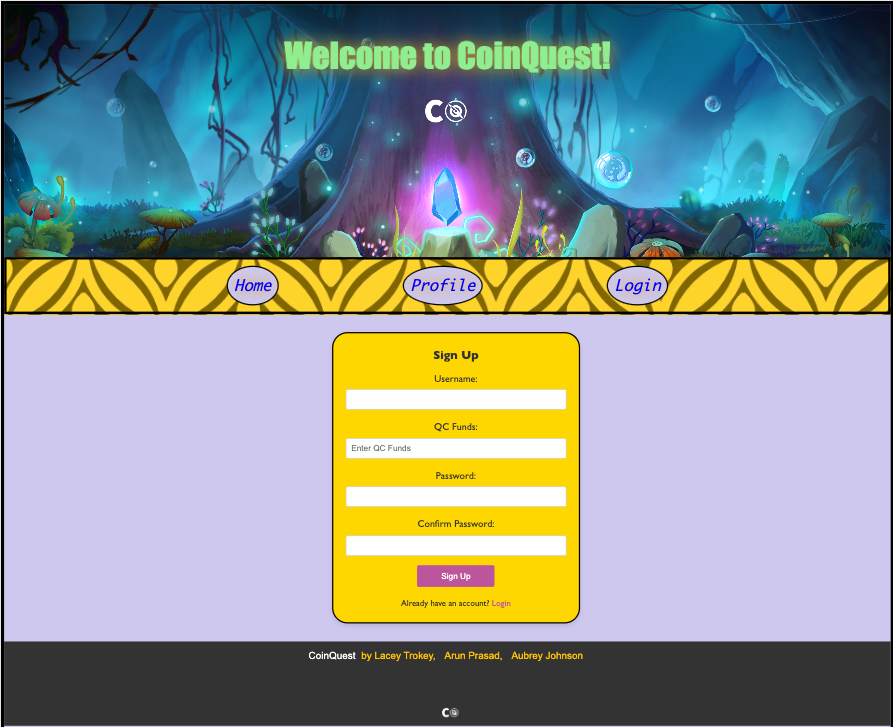
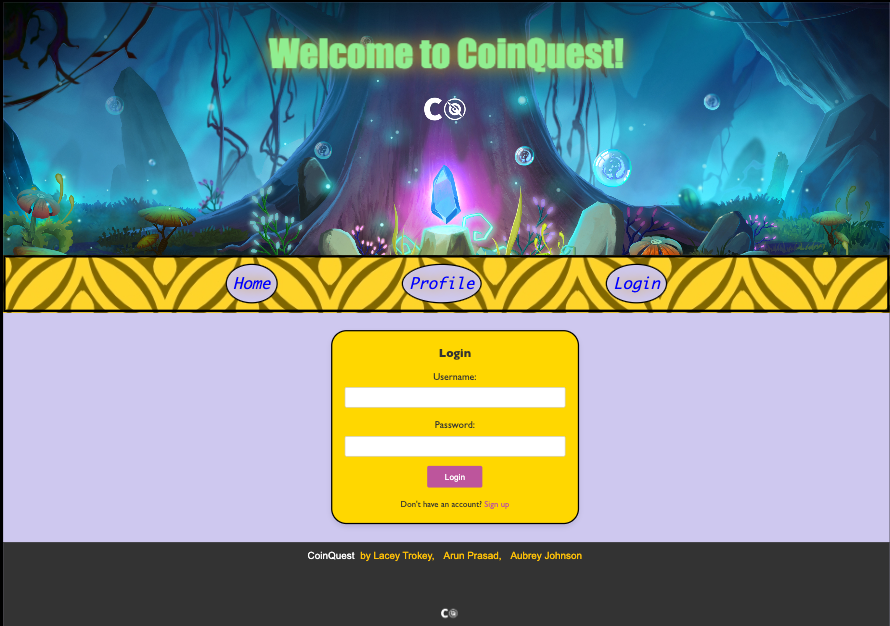
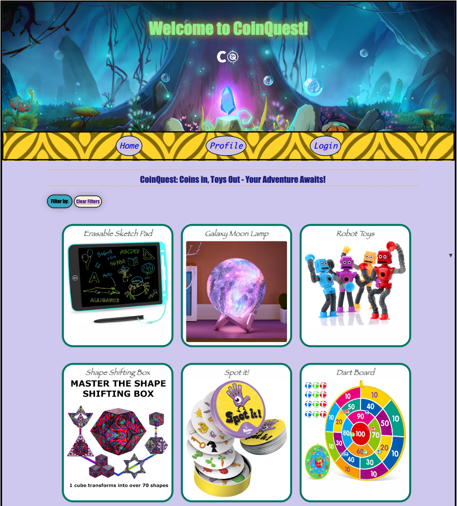
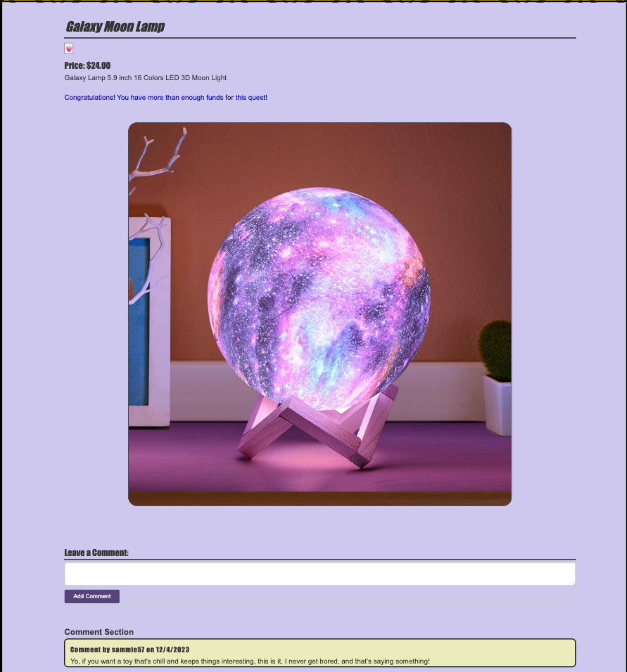
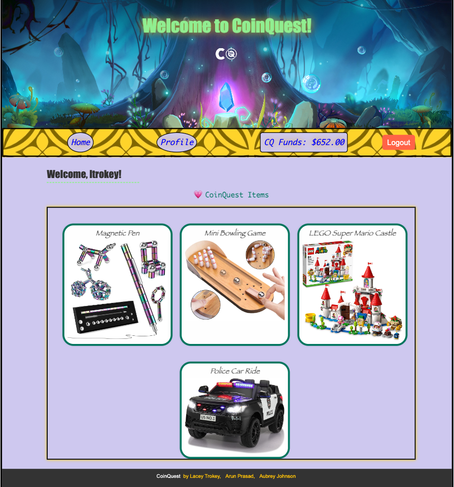
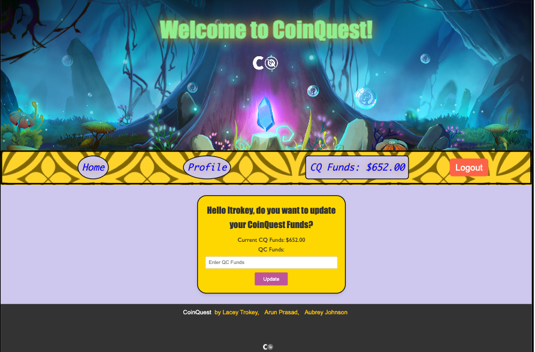

# CoinQuest

[](https://opensource.org/licenses/MIT)

[Link to live deploy](https://coin-quest-a86be143e8d5.herokuapp.com/)

## Description

Welcome to CoinQuest, the ultimate app for young explorers aged 6-12, seamlessly blending financial wisdom with the joy of playtime. More than just a platform for discovering the latest toys, CoinQuest empowers young minds with essential life skills. Featuring a secure login, personalized profiles, and an interactive digital QC Funds, kids can effortlessly manage their funds, turning pocket change into tools for realizing dreams. Dive into the world of toys with ease, selecting favorites, exploring detailed descriptions, and learning valuable lessons in cost awareness. At CoinQuest, we're driven by a commitment to instill financial discipline and responsibility in the next generation, providing a fun and engaging way for every child to turn dreams into achievable goals. Join us on this exciting adventure where savings are cool, dreams come true, and every coin counts!

## Table of Contents

- [Installation](#installation)
- [Usage](#usage)
- [Badges](#badges)
- [Collaborators](#collaborators)
- [Features](#features)
- [Questions](#questions)

## Installation

1. **Clone the Repository**
   ```
   git clone https://github.com/your/repository.git
   cd project2_group1
   ```
2. **Install Dependencies**

   ```
   npm i
   ```

   **Dependencies**

   - This application utilizes Node.js along with the following key dependencies:

   ```
    mysql: ^2.18.1
    npm i express
    npm i express-handlebars
    npm i express-session
    npm i connect-session-sequelize
    npm i sequelize
    npm i mysql2
    npm i dotenv
    npm i bcrypt
    npm i faker
   ```

3. **Database Setup**

   - Schema Creation: Run the schema.sql file provided in the db directory to create the necessary tables for the application. You can execute this SQL script in your MySQL environment directly or use commands like:

   ```
    mysql -u your_username -p

    < source db/schema.sql
   ```

   - Seed Initial Data (exit MySQL):

   ```
    npm run seed
   ```

4. **Configuration**
   - Update the connection settings in the config/connection.js & .env file to match your MySQL database credentials.

## Usage

1.  Run the Application

    - After following the installation instructions, execute the application by running the following command:

    ```
    npm start || nodemon server.js
    ```

2.  Application Instructions:

    - Sign-Up or Login: Begin your journey by creating a secure account, establishing your quest adventure on CoinQuest.

      

      

    - Explore: Journey into the homepage of CoinQuest, where a curated collection of trending quest products awaits your discovery. Navigate effortlessly through the diverse selection using the filter dropdown menu or the user-friendly navigation links. Uncover exciting possibilities with ease and enjoy a seamless exploration experience.

      

    - Express Your Voice: Unleash your thoughts and insights by sharing meaningful comments on each quest product. Your expressions add depth to the community, creating a vibrant space for shared experiences and perspectives.

      

    - Effortless Management: Empower your journey through CoinQuest with a robust profile tool. Seamlessly update your existing funds to reflect your current financial status or remove quest items that no longer align with your desires. Your profile is a powerful instrument for managing both your funds and quest items with ease.

      

      

    - Logout: When your session concludes, log out securely, knowing that your account and content are protected.

## Collaborators

- [Aubrey Johnson](https://github.com/aubreymlj96)
- [Arun Prasad](https://github.com/arunp44)

## Badges


## Features

1. Express.js for Robust Backend:

   Fast and Scalable: Our application utilizes Express.js, a fast and minimal web application framework for Node.js, serving as the backbone of our MVC architecture. This ensures that this application is not only responsive but also capable of handling a growing number of users and content.

2. Dynamic Views with Handlebars:

   Expressive Templates: The application's frontend, represented by the "View" in MVC, is crafted using Handlebars, a powerful templating engine. This allows for the creation of dynamic and expressive views, ensuring a visually appealing and user-friendly interface.

3. Secure User Authentication with Bcrypt:

   Hashed Passwords: User security is my top priority. We employed the bcrypt library to hash and salt passwords, enhancing the protection of user credentials. This functionality is encapsulated within the "Model" layer of MVC, ensuring a clean and modular codebase.

4. Session Management for a Seamless Experience:

   Persistent Sessions: We implemented session management, a key aspect of the "Controller" layer in MVC, to provide a seamless user experience. Once logged in, users can navigate the application without repeated authentication, enhancing convenience without compromising security.

5. Database Management with Sequelize:

   ORM Functionality: Representing the "Model" layer, Sequelize, a powerful Object-Relational Mapping (ORM) tool, is employed to interact with the database. This allows for efficient data storage, retrieval, and management, ensuring the reliability and integrity of the application's content.

6. Intuitive Content Management: CRUD

   CoinQuest introduces an intuitive profile, acting as the central hub for managing your personalized content. A simple click on the heart icon adds or removes items from your Quests. Additionally, users can easily update their quest funds, ensuring a personalized financial journey. The user-friendly interface is designed to keep your focus where it belongs—on what matters most, your content and financial goals.

7. Commenting System for Engaging Conversations:

   Engage with the community by leaving comments on various quest items, fostering a sense of connection among users. With our streamlined design, you can focus on what truly matters—your quests and the shared adventure.

## Questions

[GitHub Profile](https://github.com/ltrokey)

Please feel free to contact me via the email link below.

[Email](mailto:trokeyln@gmail.com)
